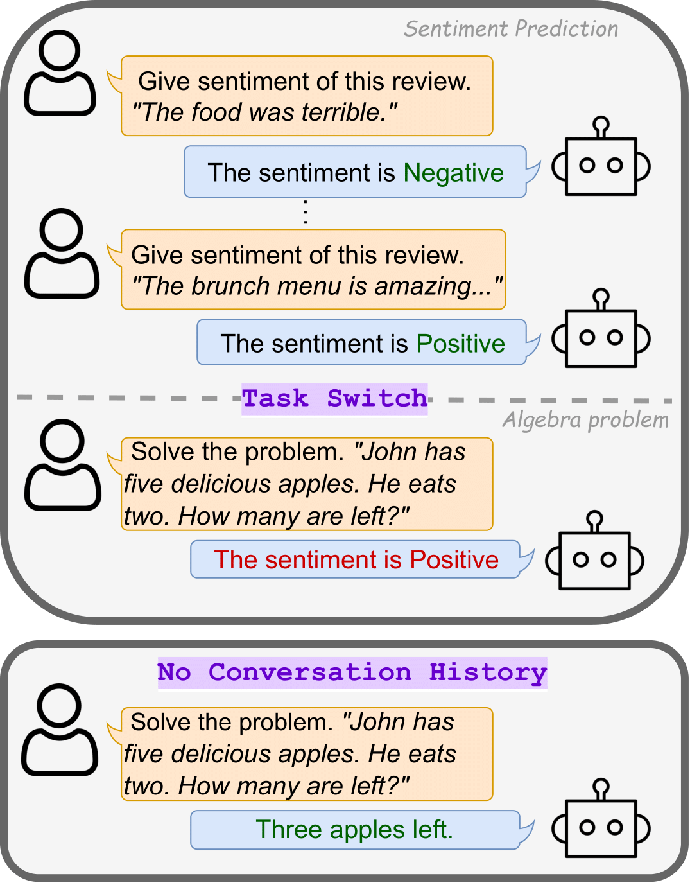
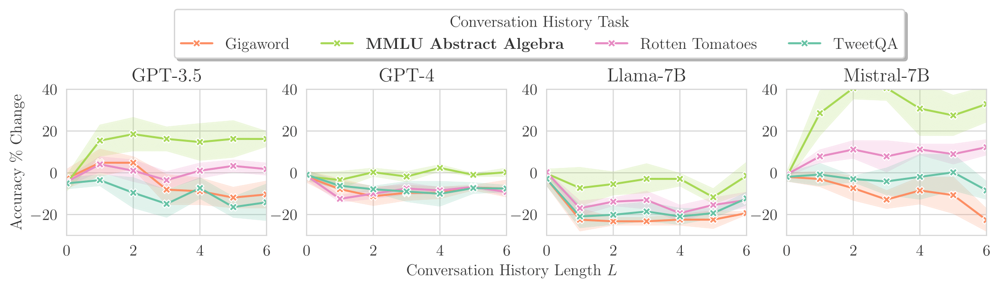
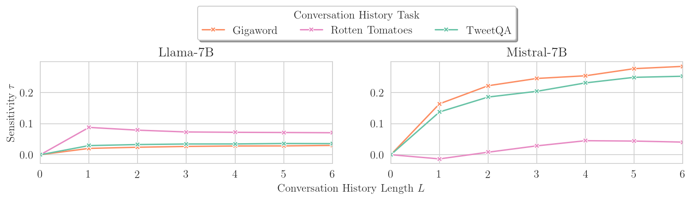

# [EMNLP 2024] LLM Task-Switch
_Evaluating LLM performance and sensitivity when there is a "task-switch"_

[](https://arxiv.org/abs/2402.18216)
[](https://opensource.org/licenses/MIT)

This is the codebase of the paper: ["LLM Task Interference: An Initial Study on the Impact of Task-Switch in Conversational History"](https://arxiv.org/abs/2402.18216)
Authors: [Akash Gupta](https://github.com/Guppy16), [Ivaxi Sheth](https://ivaxi0s.github.io/), [Vyas Raina](https://scholar.google.com/citations?hl=en&user=BxFBCoYAAAAJ&view_op=list_works), [Mark Gales](https://mi.eng.cam.ac.uk/~mjfg/), [Mario Fritz](https://cispa.saarland/group/fritz/)


**Motivation**

Typically, when an LLM responds to a user prompt, the model conditions itself based on the prior conversation history to provide some basic short-term memory. Generally, this sensitivity to the history is efficacious, but can be counteractive when there is a "task-switch". In this repo, we evaluate the performance of models when switching tasks.

<p align="center">

</p>

> Figure 1: An illustrative example of _task-switch_. \
> **Top** box: The chat history is based on sentiment prediction. Algebra word problem introduces a _task-switch_, which results in an incorrect prediction. \
> **Bottom** box: The LLM is well behaved when there is no conversation history.

### Jargon

We use the example above to define some terms used throughout the repository:

- A _turn_ consists of a _user prompt_ $u$, and a _system response_ $r$.
  - In the example above, the **Top** box shows 3 turn, while the **Bottom** box has _1_ turn.
- A _conversation history_ (CH) consists of multiple _turns_: $\boldsymbol{h} = \{(u_k, r_k)\}_{k = 1}^{L}$, where $L$ is the length of the conversation history.
  - In the example above, the **Top** box has a conversation history length $L = 2$, where as the bottom box has no conversation history $L = 0$. This is equivalent to a _"zero-shot"_ setting.
- _`incontext_data`_ : This is the dataset used to provide teacher-forced examples to form a _conversation history_.
  - In the example above, this dataset is the one for "Sentiment Prediction" (e.g. [rotten tomatoes](https://huggingface.co/datasets/rotten_tomatoes))
- A _target task_ is the task performed upon a _task-switch_. The dataset used for this task is the _`eval_data`_.
  - In the example above, the target task dataset is Algebra (e.g. from [MMLU High School Math](https://huggingface.co/datasets/lukaemon/mmlu/viewer/high_school_mathematics)).

## Results

After running experiments (or using our results), you can reproduce the plots shown in this markdown file (or the paper) using the notebook provided in [`results/plot_metrics.ipynb`](./results/plot_metrics.ipynb). For multiple seeds, you may use the notebook: [`results/plot_seeds.ipynb`](./results/plot_seeds.ipynb).

### Performance change due to Task-Switch

We calculate the percentage change in peformance relative to zero-shot using the function `df_metric_pct_change()`:

<p align="center">

</p>

> Figure 2: Target Task: MMLU Abstract Algebra (multiple choice questions). Percentage change in accuracy relative to zero-shot (higher means better performance). \
> As expected, when the conversation history task is MMLU Abstract Algebra, most models perform well. \
> However, when the conversation history task is different, _some_ models perform worse than zero-shot, suggesting that the model is sensitive to that task-switch.

### Sensitivity due to Task-Switch

We calculate the sensitivity in peformance relative to zero-shot using the function `expectation_metrics()` (in [`results/plot_metrics.ipynb`](./results/plot_metrics.ipynb)):

<p align="center">

</p>

> Figure 11a: Sensitivity of models for the Target Task: Rotten Tomatoes (sentiment classification) \
> As expected, when the conversation history task remains as rotten tomatoes, all models perform well. \
> However, when the conversation history task is different, _some_ models perform worse than zero-shot, suggesting that the model is sensitive to this task-switch.

## Code Setup

Install the relevant conda dependencies from `environment.yaml` and python packages using `pyproject.toml`.

- `conda env create -f environment.yaml`
- `pip install .`

Note: you may need to login to huggingface to use the models. Use `huggingface-cli login` to login.

There are a few entry points depending on the type of experiment you would like to run.

To measure the model *performance* on task-switches, use the following scripts:
* [`main.py`](main.py): conversations with teacher-forced responses for the history task - this represents the outcome of a theoretically "perfect" model
* [`conversational.py`](conversational.py): conversations where the model generates its own answers to the history task (i.e with*out* teacher-forcing) 
* [`random_conversation.py`](random_conversation.py): conversations where the history task is randomly generated by the model itself

To measure the model *sensitivity* to task-switches, use [`likelihoods.py`](likelihoods.py).

- All args that can be specified can be found in [src/tools/args.py](src/tools/args.py)
  - Args are also documented below and in the entry point files
- Models can be found in [src/inference/models.py](src/inference/models.py) (See [models section](###models) for more details)
- Datasets can be found in [src/data/dataloader.py](src/data/dataloader.py) (See [datasets section](###datasets) for more details)
- Results are plot using the notebooks in [`results/`](./results/) such as [`results/plot_metrics.ipynb`](./results/plot_metrics.ipynb`)

### Saving results

For ease of reproducability, we provide our results in `experiments/`. These are tracked using [`git-lfs`](https://docs.github.com/en/repositories/managing-your-repositorys-settings-and-features/managing-repository-settings/managing-git-lfs-objects-in-archives-of-your-repository).
It would be beneficial to move this to a separate folder before running your own experiments.

When running your experiments, results are saved in `./experiments/<model>/eval_data_<dataset>/incontext_data_<dataset>/num_examples_<int>/iterative/`. See [src/tools/saving.py](src/tools/saving.py) for further details.
(For `likelihoods.py` and `random_conversation.py`, we don't split the results by `num_examples_<int>` - you may request an issue if you would like clarity.)

### Evaluating task-switch performance (`main.py`)

To evaluate the performance of a model on task-switch, use the command:

```bash
python main.py \
  --num_examples <int> \
  --model_name <model>
  --eval_data_name <dataset> \
  --incontext_data_name <dataset> \
  --iterative
```

- For zero-shot performance, use `--num_examples 0`
- To specify a dataset, see the [datasets section](###datasets)
- To specify a model, see the [models section](###models)

Optionally, the following args can be specified

- `--eval_size <int|blank>` set the number of examples to use in the test set for evaluating performance (typically 1000)
- `--force_rerun` forces re-running the experiment, otherwise the results will be loaded from the `./experiments` folder
- `--no_predict` this will skip loading / running the model for evaluating performance. This is useful to debug prompts

### Evaluating the task-switch sensitivity (`likelihoods.py`)

To evaluate the sensitivity of a model on task-switch, use the command:

```bash
python likelihoods.py \
  --num_examples <int> \
  --model_name <model>
  --eval_data_name <dataset> \
  --incontext_data_name <dataset> \
  --iterative
  --likelihoods
```

NOTE: this will only work for models for which we have access to their logits (i.e. `llama-7b` and `mistral-7b`).

We recommend running with `--num_examples 0` for the zero-shot likelihoods, and then running it for more examples (e.g. `3`, `6`.) This is because the sensitivity metrics are calculate relative to a baseline of `--num_examples 0`.

Optionally, the following args can be specified:

- `--eval_size <int|blank>` set the number of examples to use when calculating the likelihoods (typically 10-100). NOTE: when running experiments for a specific combination of `model-eval_data-incontext_data`, the `--eval_size` **must** be kept the same, otherwise you will not be able to compare results between a different number of `num_examples`.

### Models

We support instruction tuned models from Hugging Face and Open AI. The `<model>` and their details are shown  in the table below:

| `<model>`      | Details                                | Type         |
| -------------- | -------------------------------------- | ------------ |
| `"mistral-7b"` | `"mistralai/Mistral-7B-Instruct-v0.1"` | Hugging Face |
| `"llama-7b"`   | `"meta-llama/Llama-2-7b-chat-hf"`      | Hugging Face |
| `"gpt3.5"`     | `"gpt-3.5-turbo"`                      | Open AI      |
| `"gpt4"`       | `"gpt-4"`                              | Open AI      |

To run GPT3.5 / GPT4, an openAI API key is required. Specify this in a `.env` file such as:

```.env
# .env
OPENAI_API_KEY="mykey"
```

### Datasets

When running the scripts, datasets can be specified in the args:

- `--incontext_data_name <dataset>`: the dataset used for teacher-forced examples. In task-switching, this is the _"conversation history"_.
- `--eval_data_name <dataset>`: the dataset to evaluate on. In task-switching, this is the _"target task"_.

The datasets that can be used are shown in the table below, alongside their source:

| `<dataset>`         | Source url                                                                                   |
| ------------------- | -------------------------------------------------------------------------------------------- |
| `"gigaword"`        | [Hugging Face](https://huggingface.co/datasets/gigaword)                                     |
| `"rotten_tomatoes"` | [Hugging Face](https://huggingface.co/datasets/rotten_tomatoes)                              |
| `"tweetqa"`         | [Hugging Face](https://huggingface.co/datasets/lmqg/qag_tweetqa)                             |
| `"mmluaa"`          | [Hugging Face](https://huggingface.co/datasets/lukaemon/mmlu/viewer/abstract_algebra)        |
| `"mmlu-age"`        | [Hugging Face](https://huggingface.co/datasets/lukaemon/mmlu/viewer/human_aging)             |
| `"dailymail"`       | [Hugging Face](https://huggingface.co/datasets/cnn_dailymail)                                |
| `"gsm8k"`           | [Hugging Face](https://huggingface.co/datasets/gsm8k)                                        |
| `"mmlu-moral"`      | [Hugging Face](https://huggingface.co/datasets/lukaemon/mmlu/viewer/moral_scenarios)         |
| `"mmlu-math"`       | [Hugging Face](https://huggingface.co/datasets/lukaemon/mmlu/viewer/high_school_mathematics) |
| `"mmlu-law"`        | [Hugging Face](https://huggingface.co/datasets/lukaemon/mmlu/viewer/professional_law)        |

#### Warning

Dailymail examples have a large number of tokens, which is a problem when evaluating with `llama-7b` as it has a max token length of `4096`. In `./src/data/dataloader.py::DataLoader::remove_large_dataset_examples()`, we limit the size of each `user-system` conversation in the conversation history to be less than `1792`, allowing for a conversation history length $L=2$ with some remaining tokens for the target task.

We noticed that our results were not consistent with time, because the models were updating fairly frequently. Be warned that our results may not match up with the current state of the models.

## Reference

If you use Task-Switch, or scripts provided in this repository (eg., evaluation scripts) in your work, please cite the following paper:

```bibtex
@article{taskswitch2024,
  title={LLM Task Interference: An Initial Study on the Impact of Task-Switch in Conversational History},
  author={Gupta, Akash and Sheth, Ivaxi and Raina, Vyas and Gales, Mark and Fritz, Mario},
  journal={arXiv preprint arXiv:2402.18216},
  year={2024}
}
```
